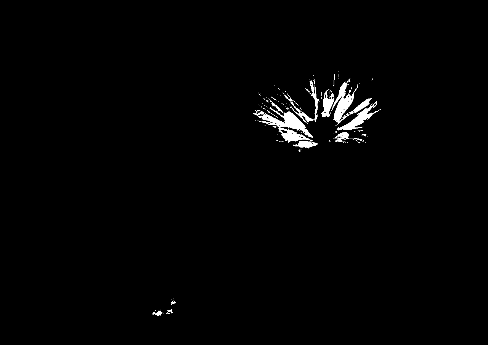
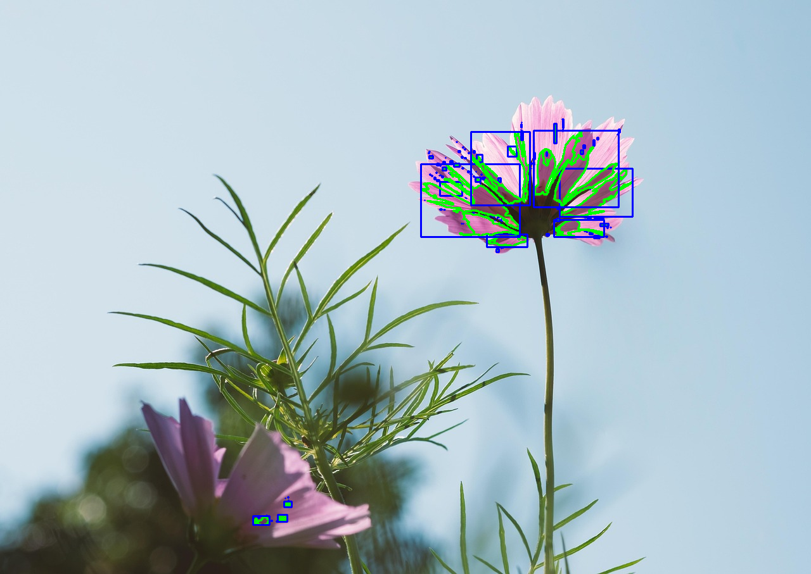
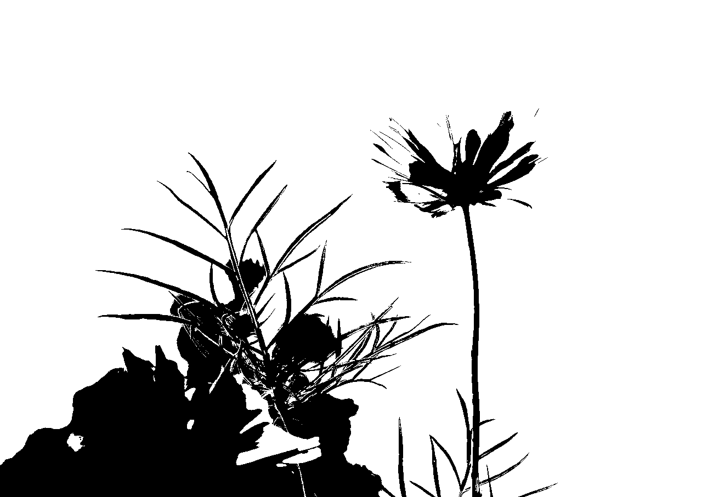
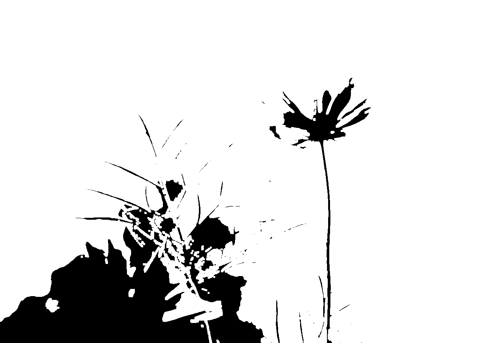
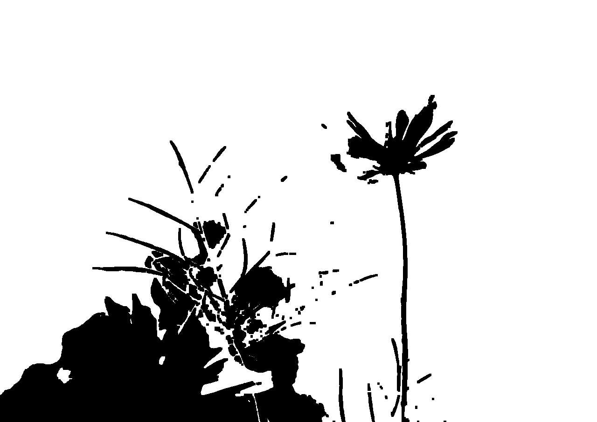
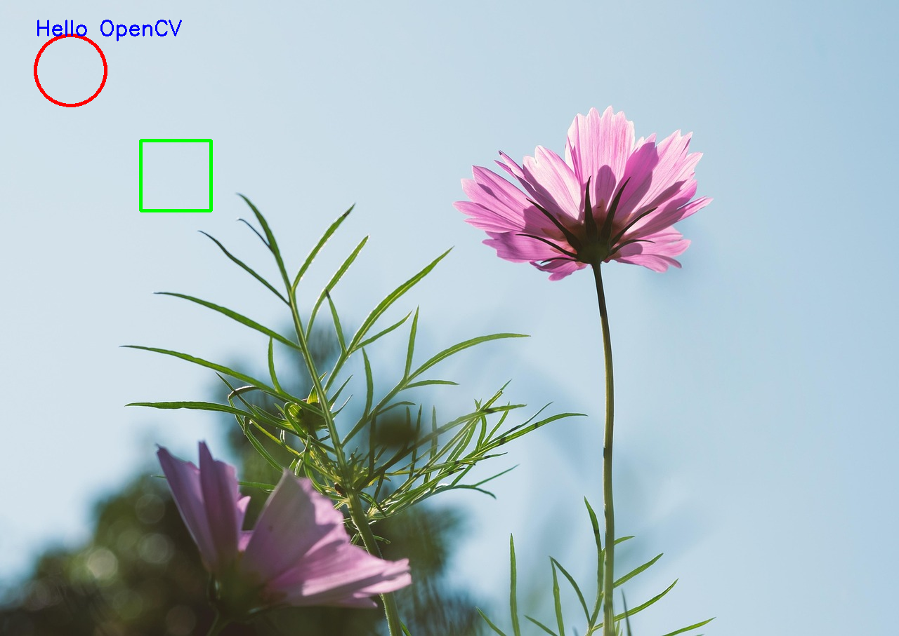
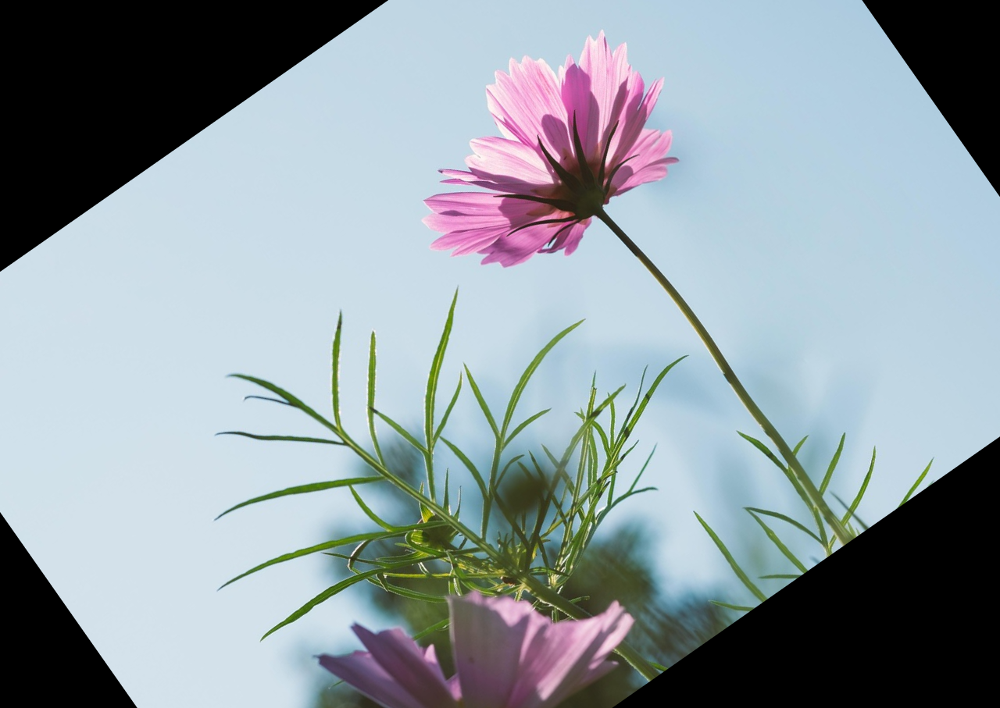
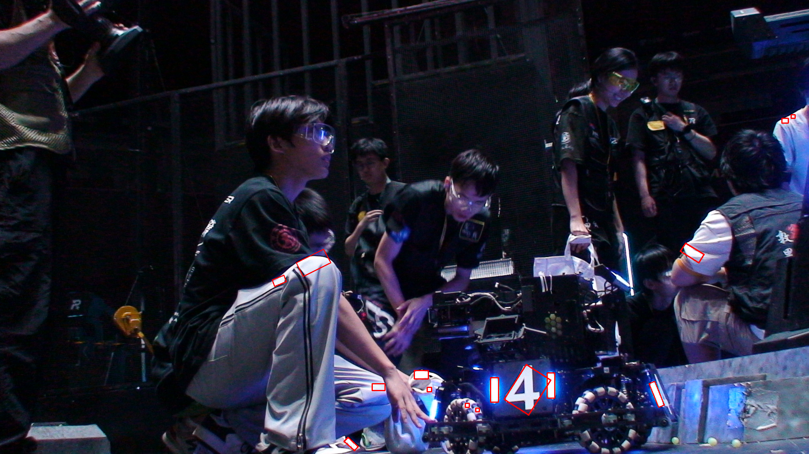
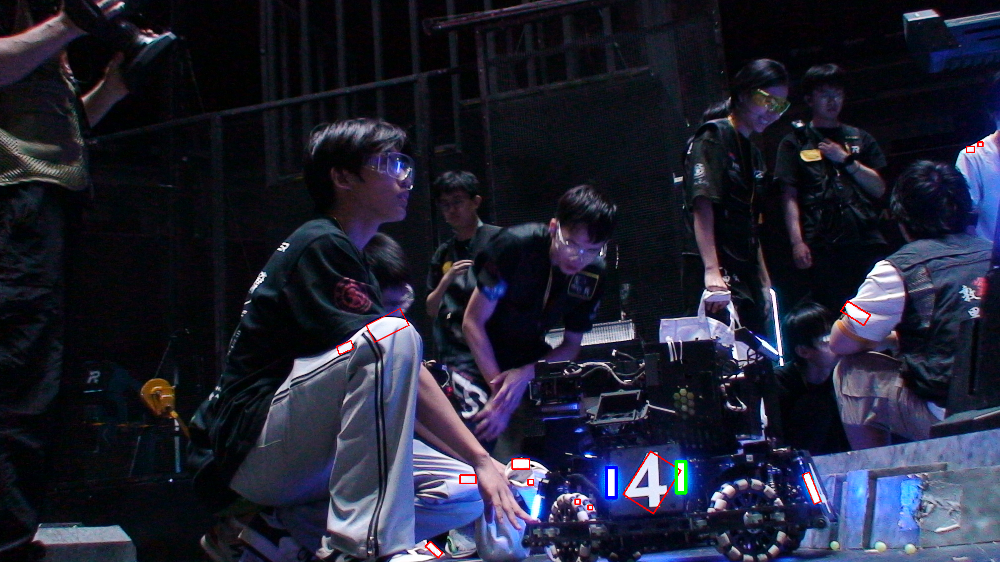

# 第二次培训任务 - OpenCV C++ 图像处理项目

## 一、任务目标
本次任务主要目标如下：  
1. 配置 C++ 开发环境：在 Ubuntu 系统中安装必要的编译器和开发工具（如 g++、CMake 等）。  
2. 安装 OpenCV 库：利用 APT 或者编译安装方式安装 OpenCV 的 C++ 版本。  
3. 组织项目结构：设计合理的项目目录结构，包括源代码、构建文件和资源文件。  
4. 实现基础图像处理操作：编写 C++ 程序完成图像处理操作。  
5. 项目构建与运行：使用 CMake 配置项目，编译并运行程序，验证功能实现。  
6. 提交任务源代码及 README：上传至 Github，并将链接发送至指定邮箱。

---

## 二、项目结构
```
opencv_project/
├── CMakeLists.txt
├── src/
│   └── main.cpp
├── README.md
├── resources/
│   ├── test_image.png
│   └── test_image_2.png
├── picture_results/
└── build/
```
- `src/`：存放主程序 `main.cpp`  
- `resources/`：存放测试图片及处理结果
- `picture_results`：存放结果图片    
- `build/`：CMake 构建生成目录  
- `README.md`：任务记录和说明  

---
## 三、任务实现思路

### 1. 基础图像处理操作

在 `src/main.cpp` 中实现了如下功能：

1. **颜色空间转换**
   - 灰度图（Gray）  
   - HSV 图（HSV）  
     
     

2. **滤波**
   - 均值滤波（Mean Blur）  
   - 高斯滤波（Gaussian Blur）  
     
     

3. **红色区域提取 & 轮廓分析**
   - 红色掩码（Red Mask）  
   - 轮廓和 bounding box（Contours_&_Boxes）  
     
     
   - 所有轮廓总面积: 15172
4. **图像形态学处理**
   - 灰度化 （Gray）
   - 二值化（Binary）  
   - 膨胀（Dilated）  
   - 腐蚀（Eroded）  
   - 漫水填充（FloodFill） 
     
     
     
     
     

5. **绘制**
   - 绘制圆、矩形及文字（Drawing）  
     
    - 轮廓和 bounding box（Contours_&_Boxes）  
     

6. **图像旋转和裁剪**
   - 旋转 35 度（Rotated）  
   - 裁剪左上角 1/4（Cropped）  
     
     

---

### 2. 实际应用：装甲板检测

1. **读取测试图片** `test_image_2.png`  
2. **装甲板检测**
   - 检测装甲板区域生成旋转矩形  
   - 绘制矩形框（Detected Armor）  
     

3. **平行矩形对检测**
   - 根据旋转矩形角度和中心距离判断是否平行  
   - 绘制平行矩形对（蓝色&绿色）  
     

---
## 四、编译与运行

```bash
mkdir build
cd build
cmake ..
make
./main